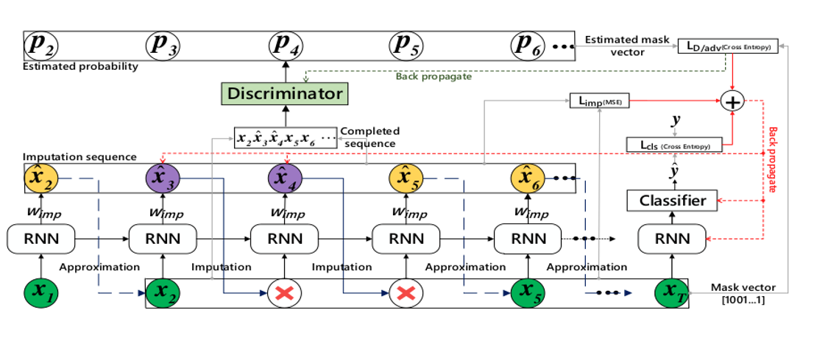

# AJ-RNN


## Background: 
- **Incomplete time series classification** (ITSC) is an important issue in time series analysis since temporal data often has missing values in practical applications.
- However, integrating imputation (replacing missing data) and classification within a model often rapidly amplifies the error from imputed values.
- **Adversarial Joint-learning Recurrent Neural Network** (AJ-RNN) is an end-to-end model trained in an adversarial and joint learning manner. It can impute missing values on the fly.
- The proposed method uses an **adversarial architecture** (GAN) to encourage realistic imputation by penalizing unrealistic imputations with an adversarial loss.


## Proposed Method:
- For ITSC, we get sub-optimal results if imputation of missing values and classification are independent steps.
The authors suggest to use an RNN to impute missing values and classify the time series simultaneously.
- In this work authors integrated adversarial training and joint (imputation and classification) learning in recurrent neural networks (RNNs) and called their system Adversarial Joint-learning RNN (AJ-RNN).
- AJ-RNN is trained to approximate the value of the next input variable when it is revealed, and to fill it in with its prediction if it is missing. At the same time, AJ-RNN also learns to classify. Hence AJ-RNN can directly perform classification with missing values.


## Model Architecture: 

[Image Credits](https://ieeexplore.ieee.org/document/9210118)


## Contributions:
- Implemented the proposed **AJ-RNN** model from scratch using PyTorch.
- Prepared **synthetic ITSC** dataset based on datasets from the UCR archive and evaluated our implementations on the prepared data.
- Informative visualisations: hidden states using **t-SNE plots**.
- Performance analysis using **Confusion matrix**. 


## Future Work:
- A proposed enhancement can be a **self-attention** module to enhance the ability of AJ-RNN for learning long term dependencies.


## Sample commands for training:

```bash
python3 ajrnn.py --batch_size 20 --epoch 100 --lamda_D 0.7 --G_epoch 5 --train_data_filename dataset/CBF/CBF_TRAIN --test_data_filename dataset/CBF/CBF_TEST --hidden_size 30
```

```bash
python3 ajrnn.py --batch_size 50 --epoch 150 --lamda_D 0.7 --G_epoch 5 --train_data_filename dataset/CBF/CBF_TEST --test_data_filename dataset/CBF/CBF_TEST --hidden_size 50 --layer_num 1 --missing_frac 0.5 --learning_rate 0.05
```


## Contributors 
- [@Kadam-Tushar](https://github.com/Kadam-Tushar)
- [@coderford](https://github.com/coderford)
